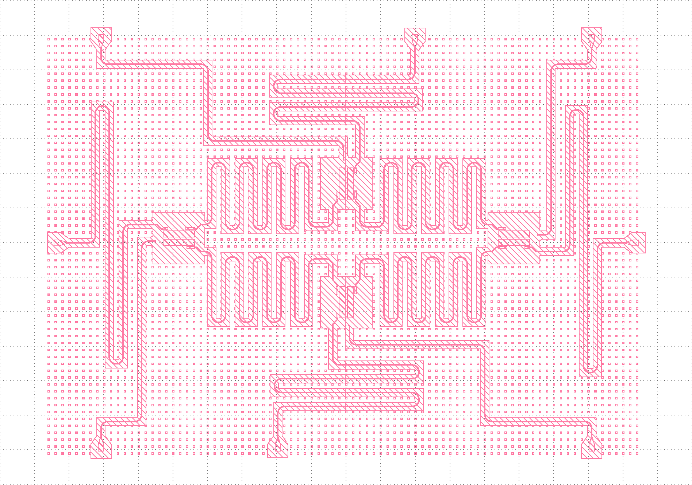
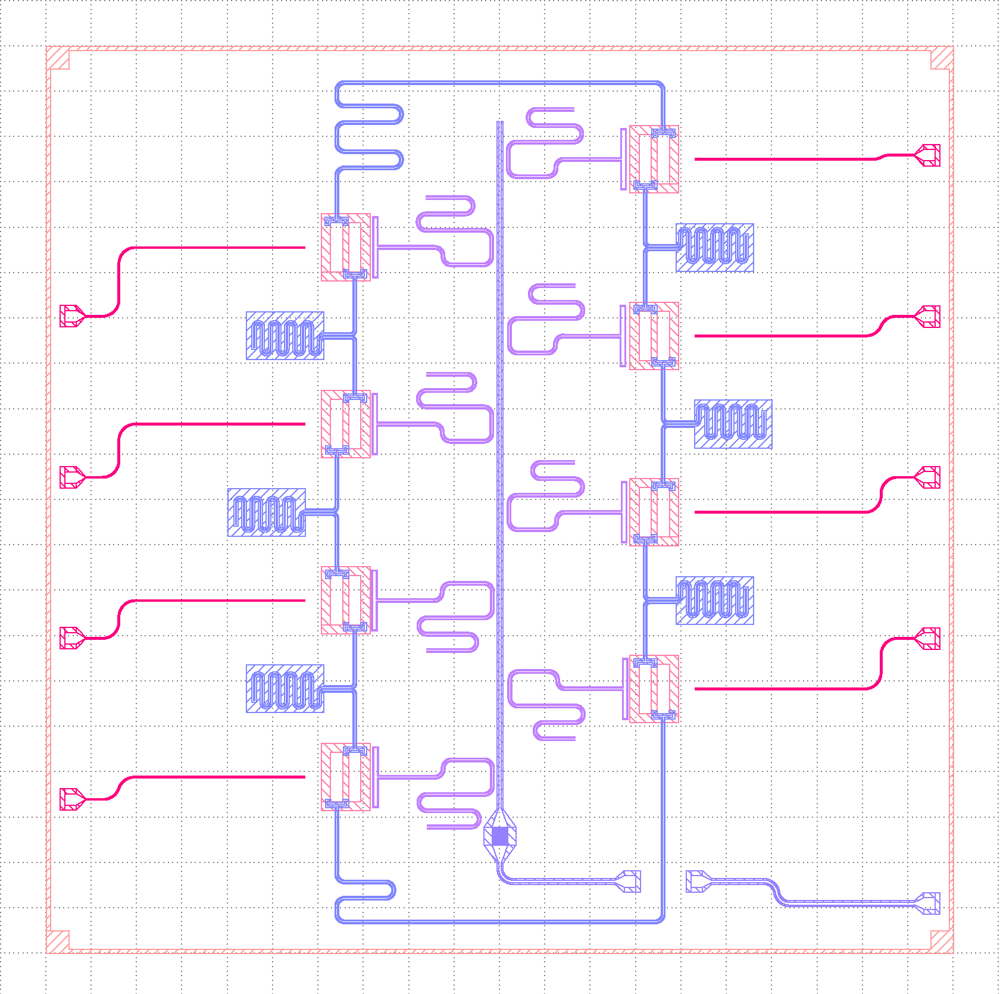

### Research at Lawrence Berkeley National Lab's Advanced Quantum Testbed (AQT).

Under Dr. Zahra Pedramrazi. 

I work on writing software to design and simulate unique SQUID Fluxonium Qubit topologies. My current 
research involves attempting to couple many qubits together with unique
capacitor architectures.  

I store old, messy work in `archive`. 

 
 
